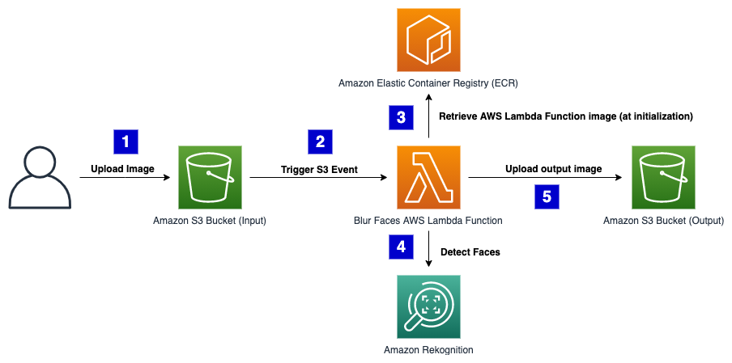

# rekognition-face-blur-sam-app

## About

This code sample demonstrates how a AWS Lambda serverless function can be invoked to call Amazon Rekognition for face detections, and use OpenCV to blur these detections. Customers can use Amazon Rekognition to enforce privacy/anonymity.

Original image             |  Blurred image
:-------------------------:|:-------------------------:
  |  

### Architecture

This code sample demonstrates how use a AWS Lambda serverless function to invoke Amazon Rekognition for face detections, and use OpenCV to blur these detections.




### Container image support in AWS Lambda
Providing your serverless functions access to OpenCV is easier than ever with [Container Image Support](https://aws.amazon.com/blogs/aws/new-for-aws-lambda-container-image-support/). Instead of uploading a code package to AWS Lambda, your function's code instead resides in a Docker image that is hosted in [Amazon Elastic Container Registry](https://aws.amazon.com/ecr/).

```dockerfile
FROM public.ecr.aws/lambda/python:3.8

COPY app.py requirements.txt ./

RUN python3.8 -m pip install -r requirements.txt -t .
RUN yum install -y mesa-libGL-devel

# Command can be overwritten by providing a different command in the template directly.
CMD ["app.lambda_handler"]
```

### Project structure

This project contains source code and supporting files for a serverless application that you can deploy with the SAM CLI. It includes the following files and folders.

- blur_faces - Code for the application's Lambda function and Project Dockerfile.
- template.yaml - A template that defines the application's AWS resources.

The application uses several AWS resources, including Lambda functions and an API Gateway API. These resources are defined in the `template.yaml` file in this project. You can update the template to add AWS resources through the same deployment process that updates your application code.

## Deploy the sample application

### Create an ECR Repository
Follow the steps here to [create a repository in Amazon ECR](https://docs.aws.amazon.com/AmazonECR/latest/userguide/repository-create.html). Then copy the repository URI, as you will need this when running `sam deploy --guided`. (i.e. `123456789101.dkr.ecr.us-east-1.amazonaws.com/test`)

### Deploy the SAM application
The Serverless Application Model Command Line Interface (SAM CLI) is an extension of the AWS CLI that adds functionality for building and testing Lambda applications. It uses Docker to run your functions in an Amazon Linux environment that matches Lambda. It can also emulate your application's build environment and API.

To use the SAM CLI, you need the following tools.

* SAM CLI - [Install the SAM CLI](https://docs.aws.amazon.com/serverless-application-model/latest/developerguide/serverless-sam-cli-install.html)
* Docker - [Install Docker community edition](https://hub.docker.com/search/?type=edition&offering=community)

To build and deploy your application for the first time, run the following in your shell:

```bash
sam build
sam deploy --guided
```

The first command will build a docker image from a Dockerfile and then copy the source of your application inside the Docker image. The second command will package and deploy your application to AWS, with a series of prompts:

* **Stack Name**: The name of the stack to deploy to CloudFormation. This should be unique to your account and region, and a good starting point would be something matching your project name.
* **AWS Region**: The AWS region you want to deploy your app to.
* **Image Repository for BlurFacesFunction**: Use the ECR repository URI you copied in the earlier step (i.e. `123456789101.dkr.ecr.us-east-1.amazonaws.com/test`)
* **Confirm changes before deploy**: If set to yes, any change sets will be shown to you before execution for manual review. If set to no, the AWS SAM CLI will automatically deploy application changes.
* **Allow SAM CLI IAM role creation**: Many AWS SAM templates, including this example, create AWS IAM roles required for the AWS Lambda function(s) included to access AWS services. By default, these are scoped down to minimum required permissions. To deploy an AWS CloudFormation stack which creates or modified IAM roles, the `CAPABILITY_IAM` value for `capabilities` must be provided. If permission isn't provided through this prompt, to deploy this example you must explicitly pass `--capabilities CAPABILITY_IAM` to the `sam deploy` command.
* **Save arguments to samconfig.toml**: If set to yes, your choices will be saved to a configuration file inside the project, so that in the future you can just re-run `sam deploy` without parameters to deploy changes to your application.

### Cleanup

To delete the sample application that you created, use the AWS CLI. Assuming you used your project name for the stack name, you can run the following:

```bash
aws cloudformation delete-stack --stack-name <STACK-NAME>
```

## Resources

See the [AWS SAM developer guide](https://docs.aws.amazon.com/serverless-application-model/latest/developerguide/what-is-sam.html) for an introduction to SAM specification, the SAM CLI, and serverless application concepts.

Next, you can use AWS Serverless Application Repository to deploy ready to use Apps that go beyond hello world samples and learn how authors developed their applications: [AWS Serverless Application Repository main page](https://aws.amazon.com/serverless/serverlessrepo/)

## Credits

* Adrian Rosebrock, Blur and anonymize faces with OpenCV and Python, PyImageSearch,
    https://www.pyimagesearch.com/2020/04/06/blur-and-anonymize-faces-with-opencv-and-python/,
    accessed on 6 January 2021
* <span>Photo by <a href="https://unsplash.com/@nickxshotz?utm_source=unsplash&amp;utm_medium=referral&amp;utm_content=creditCopyText">Nicholas Green</a> on <a href="https://unsplash.com/s/photos/crowd?utm_source=unsplash&amp;utm_medium=referral&amp;utm_content=creditCopyText">Unsplash</a></span>

## Security

See [CONTRIBUTING](CONTRIBUTING.md#security-issue-notifications) for more information.

## License

This library is licensed under the MIT-0 License. See the LICENSE file.

